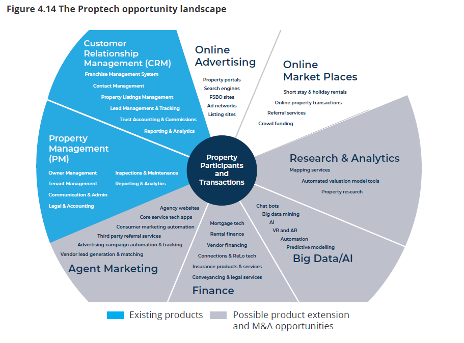

# **In The Begining**

Proptech like Fintech is relatively new, despite being intergrated in the Austalian real estate market for over 20 year, back in 1997 the revolutionary Customer Relationship Mangement *(CRM)* software MyDesktop was launched by Adam Campbell & Scott Wolff. This was the begining of Proptech Group *(PTG.ASX)*, as the name suggest it is a group of property technology companies in one eco-system. 

MyDesktop was acquistioned by Domain Holdings Austalia Limited *(ASX:DHG)* in 2010, In the same year "Real Estate Investar luanches property investment platform, and Rentfind Inspector launched"[^1]. These three brands later listed under Real Estate Investar *(ASX:REV)* in 2015. 
Adam Campbell & Scott Wolff set up VaultRE for Real Estate CRM PTY LTD *(ASX:RECRM)* 2nd generation CRM with Project MAnagement *(PM)* platform in 2017. In 2020 REV merge with RECRM formed PTG[^2]

Bill nikolouzakis Proptech Group Chief Operating Officer (COO) explains Proptech Group's mission is to 

---
 >*"help agents through technology, streamline, optimise and where possible automate the selling and renting of realestate. Our goal is to brng all our innovative products under one roof bringing the best of the industry together in one ecosystem"*[^3]
 ---

 
| Pioneering spirit | People First | Industry Champions | Leading Positive Change |
| ----------|---------|------|----|
| Our eyes are on the future. We’re driven to be the best, so we can make a real difference. | A return to what makes our industry great. We work to create a better experience for agents and customers. | We’re at our best when we partner with property professionals. We’re invested in the whole ecosystem. | In consultation with the industry, we’re working together to improving efficiencies, workflows and processes.|

Table 1.0 *PTG Four Main Value*[^4]

---

Figure 1.1 *Corporate Structure of Proptech Group*[^5i]

---
 

Figure 1.2 *Timeline of Proptech Group*[^6i]

---
## **Governing Metrics** 

Being real estate core drvien PTG focuses on the cost/efficency of the process when selling or renting of properties. This includes the property management of rental properties. PTG primaryily focuses its Software as a Service (SaaS) to real estate Agents Offices and tenants. Specifically the following clasification:

1. **CRM** focused around Business to business (B2B) is to add efficinecy to real estate offices during the selling phase. Listing management, advertising, conveyancing,  trust accounting to sales accounting

2. **PM** focused around Busines to Consumer (B2C) easy to buy sell and rent in Austalia, New Zealand and the United Kingdom; property management fees, valuations, legal and taxation services, property inspections, Insurance, utilities, repairs  & maintenance

PTG has always been a subscription-based software operating service. These fees are brokendown to the following;  

| Revenue Source | B2B/REal eState Agency Products | B2C/ Property Tools|
|----------------|-------------------------------------------------------------------------------------------------------------------|-----------------------------------------------------------------------------------------------------------------------|
| Subscrition Average Revenue Per Agency (ARPA) | calculated as total revenue generated for the previous 12 months divided by total number of paying office subscribers at the end of the period (then divided by 12 to get an average monthly view). Over time ARPA is increased through additional product features and price increases | Monthly fee to use the platform - ranging from $99 per month for the basic package to $248pm for the advanced package |
One off fees | Charged to agencies for training, consulting and some customised development of the platform, usually at the franchise group level | |
Pay as you go user fees | Add on products sucahas SMS charged on a pay as you go basis | |
Referral/commision fees | Third products offered to agencies on a referral or commission sharing basis

Table 1.3 *Revenue Source* [^5]

---

As the revenue is generated per agency we can simply look at the total number of agencies that use CRM and PM and gague the leading perfomers.

| Country | Real Estate Agencies| Indvidual agencies | Market Size |
| --------|---------------------|--------------------|-------------|
| Australia | 11,000 | 35,000 | ANZ $117 million in 2019|
| NZ | 1,200 | 14,000| ANZ $117 million in 2019 |
| UK | 25,000 | 21,200 | $185 million in 2019

Table 1.4 *Market Size, Real Estate Office* [^6]

---

| Brand                 | SaaS     | Offices Served (Estimate) | Comments                                |
|-----------------------|----------|---------------------------|-----------------------------------------|
| MyDesktop/Vault Group (Pior PTG) | CRM & PM | 2,800 AU, 380 NZ, 251 UK | ANZ 41,000 individual users | 
| AgentBOx | CRM & PM | 2,000 | Funded $21.8 million by AcelKKR in 2018 |
| Box + Dice | CRM | 1,000 | ANZ 14,000 active users |
| Console | PM | 3,000 |$20 million revenue in 2019 |
| REI Master | PM | 1,300| - |
|Rex Software | CRM | 1,300 ANZ, 200 UK | 7,500 individual users\Rockend |
| Rockend Technology | PM | 3,500| $37  millionrevenue in 2019|

Table 1.5 *2019 Market Share Proprtech, CRM & PM* [^7]

---

In 2019, it was estimated in Australia alone there was a real estate software market of $101 million, PM generated $65 million and CRM comprmising $36 million. PTG holds the largest australian market share of 25%.

**2019 Australia CRM Market Share**

Graph 1.6 *2019 Market Share Proptech, CRM & PM* [^8] 

---
---

# **Mortgage / Real Estate Domain**

Since 1997 during the Dot com boom, technology has exponital become more capable and widely used by the general public. During the past 10 years new competitors have established themselves with the knowledge of fualts in MyDesktop, with more; advanced start up technology during the development phase. Having better technical and infrastracture technology / design. New competitors like Agentbox, Box + Dice, REX, Zenu, VaultRE (ex MyDesktop Developers) seemed very attractive to the established MyDesktop users. The population was becoming more and more tech savy, while their patients grew thinner. The custmer service alone amongest the competitors far exceeded the arrogant and notoriously week long trobleshooting many *MyDeskteop* users experienced.[^9]

## **The Attraction**
At certain periods housing boom in Australia drew more media attention than technology advancment. In 2021 December quarter, the total value of residential dwellings in Austalia was $9,901.6 billion, from $9,388.9 billion in september of same year. It is more shocking to see 5 years ago December 2016 total value of dewllings in Australia was $6,441.2 billion.

**Market Value**

Figure 2.0 *Total Value of Dwelling Stock, Australia* [^10]

---

**Average Dwelling Price**

FIgure 2.1 *Mean Dwelling price, statesand territories, December quarter 2021*[^11]

---

 In addition to price per dwelling increased, Australia has sold 598,000 hosue and unit in the year ending August 2021. This is a 31% increase from a decade average and 24% increase from a twenty decade average.

**Sold Properties in Australia**

 
 Figure 2.2 *Annual number of dwelling sales, Australia* [^12]

---

 The Real Estate market was evidently growing both in market capital and market acceptance. More people are willing to buy property for a higher than record price. For real estate agents to earn more commision, efficieny was the key. Popularity for an autonomising mundane task through CRM and PM system grew amongst real estate offices over the years. However, the systems needed to be more fluid and integrating differnet agenecies requirements inorder to run selling a property (CRM): 

- Automising leads, optimising AI and machine learning to perform progressive profiling. Matching of buyers with agents, by data such as investment interest/timeframe to upto date market and suitable agent
- Live notification of offers; once vendors and agents are in the system, machine learning is able to automatically track their progression within the cycle. This contact segmentation empowers agents and vendors with up-to-date information
- Contact scoring automation, using JSOn script in Swagger, CRM is able to assign a point system to users action, such as requesting for an apprasial/ loan investigation. the more action is trigged the system will identify the user as a hot seller, automising leads
- Portal pushing, through API integration, a listing just needs to be uploaded onto the system inorder to synchronise across all linked real estate portals  
- Single data entry, simply enter information about clients into CRM once, automised to enter relevant information accross integrated third party add ons through open API

The co-developers of *MyDesktop* and *VaultRE* were able to understand the evolving need of agents to stay on top of the expanding market. By seamlessly integrating advance workflow automation, functioality, the best in AI, open API-first, algorithms, data infrastructure, code base, online processes and other information technology.[^13] Proptech Group developed a more advanced CRM system *eagleSoftware*. Through this software, fintech brands Covini, FLipay and BC invest has integrated with *eagleSoftware* to launch Rello, a new payment platform. With Rello PTG has revolutionised the payment method for all real estate transactions. Payment options include the recen ttren buy now pay later, commision advance, payment plans to name a few. 

---
---

# **ANZ Market Dominance**
 
## **Business Activities**

Having the ownership of the core agency software piece of both servers CRM and PM allows PTG to add third party products either ones that PTG develops or external integration along the value chain, since dec 2020 add on tools increased from 300 to over 700 add on tools. This allows subcribers to manage a range of vendors with one system. Increasing the market share will increase the add ons through deep API integration, leading to increase ARPA.

Once PTG CRM/PM system are integrated into the work flow, PTG is able capitalise the relationship to add Fintech option PropPay payment solutions to help manage relaste agents cash flow and tenant payment options including buy now pay later, access to early commision, and automated payment services.

The main advantage PTG has over its competitors is they have the industries best working together. to name a few;
 - Scott Wulff (Executive Director and General Manager VaultRE) & Adam Campbell (Technology Director) , co-founder and developer of MyDesktop and VaultRE
 - Luke Thomas, led the wireless and mobility technology sales channel for companies including AAPT, Optus $ TElestra. Chei Operating Officer - Website Blue
 - Audry Nicoll, extensive experience in market entries and strategic growth marketing in the US, ANZ and the UK. Group Head of Marketing
 - Joe Hanna, held various senior management & technology roles at Fairfax Digital. Joe was an Executive Director of both REV and RECRM. Managing Director and Group CEO 
 - Micheal Fiorenza, with over 14 years international experience in finance & accounting. He is the CFO of Real EstateInvestar (REV.ASX), and previous CFO of the VC fund CAV Investment Group. Group Cheil Financial Officer   

 In 2019, it was estimated in Australia alone there was a software market at $101 million, PM generated $65 million and CRM comprmising $36 million. PTG holds the largest australian market share of 25%.

By October 2020 PTG introduces *Eagle Software* a cloud based CRM platform integrating far more vendors and offerering more services on the same system. This lead to an increase in market share to 41% 

**2020 Australia CRM Market Share** 

Figure 3.0 *LArgest Real Estate CRM Customer Base* [^14]

---

**Proptech 2020 Finacial Revenues** 

|FY20 Pro-Forma | B2B | B2C | Corporate | PropTech Group |
|---------------|-----|-----|-----------|----------------|
|SaaS Revenue | $8,742,477 | $1,006,496 | - | $9,748,973
Other operating revenue | $1,006,148 | $32,185 | - | $1,038,333
Total Revenue | $9,748,625 | $1,038,681 | - | $10,787,306
COS | ($873,111) | ($230,308) | - | ($1,103,419) 
| Gross Profit | $8,875,514 | $808,373 | - | $9,683,887
|GP% | 91% | 78% | - | 90%
EBITDA | $2,946,365 | $76,391 | ($774,783) | $2,247,973
EBITDA % | 30% | 7% | - | 21%

Table 3.1 *Segmented Pro-Forma FY20 Revenues* [^15]

---

Figure 3.2 *2022 live Statistics* [^16i] 

---

## **Competitors**

**Agentbox** holds the second largest CRM market share in Australia, based off the top 100 agents in Australia over 60% uses Agentbox, this is a 20% increase from 2019. Agentbox also boost a cloud based CRM and PM software that integrates with partners to manage vendors through each phase of the selling and renting of property. Agentbox is the market leadin mobile solution and industry leading data management, this SRM is umatched for ease of use, speed and depth of functionality. in 2020 Accel-KKR a technology based investment firm with 10 billion in capital commitments, has annonced a 
>"strategic expanson and acquisition strategy in the Australian and New Zeland proptech market with the goal of doubling in size within two year." [^16]

**Rex** is the thrid largest market share in the CMR software sector. Like its stronger compitior Rex focuses on automation of mundane tasks to effiecntly drive real estate agents in the selling propery. In 2021 the launch of Zapier allows users to integrate over 3,000 apps to rex CRM system. to name a few dropbox, facebook Lead Ads, Mailchimp, slack etc. This arguably gives rela estate more freedom when choosing their prefered autonomise preferrenece. [^17]

---

Figure 3.3 *2022 live Statistics* [^17i] 

---

**MRI software** founded in 1971, based in CLeveland, Ohio, has strived to creat flexible game-changing solutions. This global real estate technology expanded to Australia and New Zealand in 1995. In 2014 Commercial Property Excutive (CPR) awarded *Box + DiceMRI Software* two catagories within the event, Australias Tops in Technology Awards, specific qualities:[^18]
- "Best Features/ Functionality"
- Greatest Ease of Use/Implementation
- Best Pricing/Value

In 2021 MRI Software invested further on our shores by aquistioing Palace, Whoson LOcation, and Box + Dice. The Austrlaian based CRM *Box + Dice* established themselves in 2005 and has over the years using technology to intergrate an autonomous platform to gain the 4th market share of CRM in Australia. [^19]

---

Figure 3.4 *2022 live Statistics* [^19i] 

---
---

## **Recommendations**

PTG's largest profitable revenue stream is its CRM platform, however they have yet to cover all spectriums to an industry leading standard. In the financial year of 2020 PTG had an Annual recurring revenue of $12.4 million. Since PTG is a high revenue earning company they are able to invest a portion of gross profit in development or aqusition of proptech companies. To maintain the companies existing platform, it would be best practice to select potential proptech companies that have the following;
- have a signficant customer base, that ties in with PTG existing customers
- clear profitability path
- well established in their market, or hav epotential to be
- management is structured and effective
- can clearly outline a framework to integrate to PTG lacking areas

---

Figure 4.0 *The Proptech Opportunity Landscape* [^25]

---

### **Marketing growth**
PTG has esatblished a steady 40% of the Australian New Zealand CRM Makret share beining 3,465 out of roughly 12,200 residential real estate agencies. Commercial agencies has well over 18,000 offices. PTG would benefit from a larger market by integrating similar services, such as 
- automating the dudeligence of selling commercial property
- audio recording of notes during showing
- import property date, or view saple properties in the same market
- update client or property date anywhere

In United Kingdom there is approximate 21,500 offices that could utilise PTG's existing CRM and PM software. PTG could like previously target marketing campign to large real estate franchise, thereby simultaneouly signing large numbers of agencies. 

As of 2021 there are 154,431 customers using the basic free property investment platform, out of this only 1,037 are paying cutomers. These are strong leads that have already trusted PTG enough to use its software. Inorder to capitalise on this survey could be preofromed of non paying customers in exchange for temporary access to or unlock one or two premium services. THis information can then be analysed to perfom target adds or innovate new services, inorder to gain more paying customers.

The above recommendations are inline with existing proven streams of revenue, being Average REvenue Per Agency (ARPA). In 2019 ARPA in ANZ was $197, by September 2021 ARPA increase dto $236. This was inline with the merger of Investar and VaultRE, integration egalysoftware and rello along with hundreads of add-ons by PTG or third party developers. This in all contributed to clients fredom when customizing the CRM for their agency.   

[^1]: *Proptech Group Website About Me page*, https://proptechgroup.io/about/

[^2]: *Frost & Sullivan, page 8*, https://www.fnarena.com/downloadfile.php?p=w&n=0AEE9E35-E5DC-75F2-97AB34BB6A441C3D#page8 

[^3]: *Proptech Group, Home Page*, https://proptechgroup.io/video-what-is-the-proptech-group/

[^4]: *Proptech Group Website About Me page*, https://proptechgroup.io/about/

[^5]: *PropTech Group Prospectus, page 54*, https://f.hubspotusercontent10.net/hubfs/435410/PropTechGroup/Proptech_Prospectus_Final_compressed%20(1).pdf

[^6]: *Frost & Sullivan, page 9*, https://www.fnarena.com/downloadfile.php?p=w&n=0AEE9E35-E5DC-75F2-97AB34BB6A441C3D#page8 

[^7]: PropTech Group Prosppectus, *page 78*, https://f.hubspotusercontent10.net/hubfs/435410/PropTechGroup/Proptech_Prospectus_Final_compressed%20(1).pdf

[^8]: *Frost & Sullivan, page 58*, https://www.fnarena.com/downloadfile.php?p=w&n=0AEE9E35-E5DC-75F2-97AB34BB6A441C3D#page8 

[^9]: *Is My Desktop a Sinking Ship?* https://www.proptechnow.com.au/2020/02/is-mydesktop-a-sinking-ship/

[^10]: Residential Property Price Indexs: Eight Capital Cities, *"Total Value of Dwelling Stock"* https://www.abs.gov.au/statistics/economy/price-indexes-and-inflation/residential-property-price-indexes-eight-capital-cities/latest-release

[^11]: Residential Property Price Indexs: Eight Capital Cities, *Mean dwelling price, states and territries, December quarter 2021*  https://www.abs.gov.au/statistics/economy/price-indexes-and-inflation/residential-property-price-indexes-eight-capital-cities/latest-release

[^12]: Housing turnover reaches the highest level in nearly 12 years, *Annual Number of Dwelling sales, Australia*  https://www.corelogic.com.au/news/housing-turnover-reaches-highest-level-nearly-12-years

[^13]: PropTech Group Prosppectus, *page 84*,https://f.hubspotusercontent10.net/hubfs/435410/PropTechGroup/Proptech_Prospectus_Final_compressed%20(1).pdf 

[^14]: Proptech Group: ANnual General Meeting 2021, *Slide 10*, https://proptechgroup.io/wp-content/uploads/2021/12/2021-AGM-Presentation.pdf

[^15]: PropTech Group Prosppectus, *"Table 4.3 Segmented Pro-Forma FY20 Revernues"; page 78*, https://f.hubspotusercontent10.net/hubfs/435410/PropTechGroup/Proptech_Prospectus_Final_compressed%20(1).pdf

[^16]: AGENT BLOG, *"Agentbox announces AUS/NZ proptech acquisition strategy"; Sydney, AUS — December 2, 2020* https://agentbox.com.au/agentbox-announces-aus-nz-proptech-acquisition-strategy/

[^17]: REX; Articles, *"Introduction Rex + Zapier Integration", March 2021* https://www.rexsoftware.com/articles/introducing-rex-zapier-integration-2

[^18]: MRI Real Estate Software; *"About MRI Software"* https://www.mrisoftware.com/au/about/

[^19]: Box + Dice; *"About"* https://www.boxdice.com/about 

[^5i]: PropTech Group Prospectus, *"Corporate Structure of Proptech Group", page 44*, https://f.hubspotusercontent10.net/hubfs/435410/PropTechGroup/Proptech_Prospectus_Final_compressed%20(1).pdf

[^6i]: PropTech Group Prospectus, *"Figure 4.1 Timeline of Proptech Group" page 68*, https://f.hubspotusercontent10.net/hubfs/435410/PropTechGroup/Proptech_Prospectus_Final_compressed%20(1).pdf

[^16i]: Proptech Group; *Home Page* https://proptechgroup.io/?utm_term=proptech%20group&utm_campaign=PropTech%20Group%20Brand&utm_source=adwords&utm_medium=ppc&hsa_acc=7792876160&hsa_cam=14879255002&hsa_grp=128546588575&hsa_ad=550323579489&hsa_src=g&hsa_tgt=kwd-1032947099667&hsa_kw=proptech%20group&hsa_mt=p&hsa_net=adwords&hsa_ver=3&gclid=CjwKCAjwiuuRBhBvEiwAFXKaNGN2KdyPG6RIhIBI-H4fwwLy93RxD2b7-tSNViOaCjHZVSlbiFPj1xoC64cQAvD_BwE

[^17i]: Rex; *About Page* https://www.rexsoftware.com/about-us

[^19i]: Box + Dice; *About Page* https://www.boxdice.com/about

[^25]: PropTech Group Prospectus, *"Figure 4.14 The Proptech opportunity landscape" page 82*, https://f.hubspotusercontent10.net/hubfs/435410/PropTechGroup/Proptech_Prospectus_Final_compressed%20(1).pdf